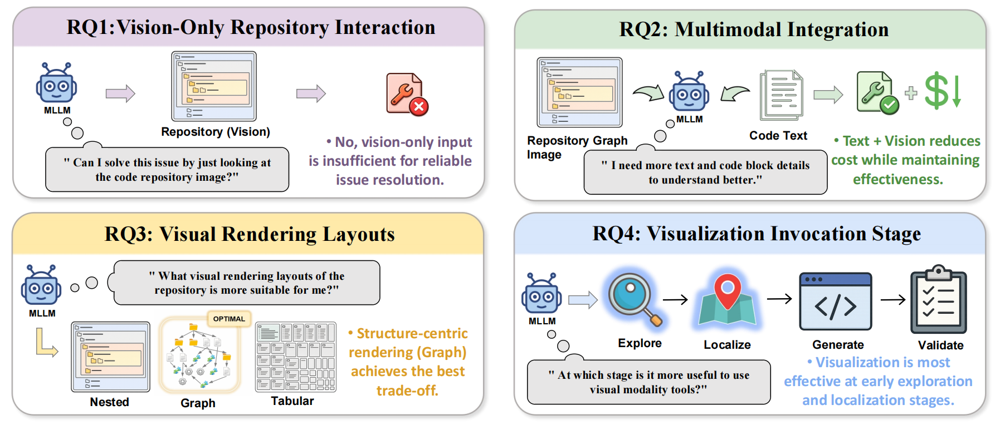

<p align="center">
  
</p>

# LLM Agents Can See Code Repositories

[](https://www.python.org/downloads/)
[](https://www.swebench.com/)
[](https://www.docker.com/)
[](src/minisweagent/run/extra/utils/build_graph.py)
[](https://github.com/SWE-agent/mini-swe-agent)
[](LICENSE)

SeeRepo extends [mini-swe-agent](https://github.com/SWE-agent/mini-swe-agent) with a **pre-built repository structure graph**, enabling agents to navigate large codebases efficiently and resolve GitHub issues on [SWE-bench](https://github.com/swe-bench/SWE-bench).

<p align="center">
  
</p>

## 💡 Core Innovation

Standard coding agents rely entirely on shell commands (`grep`, `find`, `ls`) to explore a codebase—costing many steps before any edit is made. SeeRepo provides each agent with a pre-built **repository graph** that encodes the structural relationships of every file, class, and function in the target repository.

### 🕸️ Repository Graph

The graph is built offline per repository (stored as a `.pkl` file) and contains four edge types:

| Edge Type | Direction | Use Case |
|-----------|-----------|----------|
| `contains` | directory → file → class/function | Verify file paths, visualize directory layout |
| `imports` | importer → imported module/symbol | Find all files related to a concept |
| `invokes` | caller → callee | Trace execution flow to localize a bug |
| `inherits` | subclass → base class | Understand class hierarchy |

Agents query the graph at inference time via a CLI tool:

```bash
python -m minisweagent.run.extra.utils.graph_visualization \
  --pkl repo_graph.pkl \
  --node "path/to/file.py" \
  --edge-type imports \
  --up-depth 1 --down-depth 1
```

### 🔨 Graph Building

The graph is constructed entirely from static analysis of Python source files using the `ast` module—no execution needed. See [`src/minisweagent/run/extra/utils/build_graph.py`](src/minisweagent/run/extra/utils/build_graph.py).

## 🚀 Installation

```bash
git clone <this-repo-url>
cd SeeRepo
pip install -r requirements.txt
pip install -e .
```

- **License:** Apache-2.0 (see [`LICENSE`](LICENSE)).
- **System:** Docker for SWE-bench; for graph PNG rendering, install the Graphviz `dot` binary (e.g. `apt install graphviz`).
- **Optional LiteLLM model registry:** if your provider uses custom model ids, set `LITELLM_MODEL_REGISTRY_PATH` to a JSON file (see LiteLLM `register_model` docs).

## 🗂️ Building the Graph Index

Before running on SWE-bench, build (or download) a graph index—a directory of `{instance_id}.pkl` files, one per benchmark instance.

```bash
export SEEREPO_GRAPH_INDEX_DIR=/path/to/your/graph_index

python scripts/build_graph_index.py \
  --dataset princeton-nlp/SWE-Bench_Verified \
  --split test \
  --output-dir $SEEREPO_GRAPH_INDEX_DIR \
  --workers 8
```

The script starts each SWE-bench Docker image, extracts the repository from `/testbed`, builds the graph, and saves `{instance_id}.pkl` to the output directory.

## ▶️ Running on SWE-bench

### 1. Set the graph index path

```bash
export SEEREPO_GRAPH_INDEX_DIR=/path/to/your/graph_index
```

### 2. Run the agent

```bash
python -m minisweagent.run.extra.swebench \
  --subset verified \
  --split test \
  --config src/minisweagent/config/extra/SeeRepo.yaml \
  --workers 4 \
  --output trajectories/seerepo_verified
```

See [`scripts/run_swebench.sh`](scripts/run_swebench.sh) for a complete example.

### ⚙️ Configuration files

| Config | Graph Strategy |
|--------|----------------|
| `SeeRepo.yaml` | Always query graph first |
| `SeeRepo_smart.yaml` | Smart: query graph only when the file path is not already known |

The default model is `openai/gpt-5-mini`. Override via `--model`:

```bash
python -m minisweagent.run.extra.swebench \
  --config src/minisweagent/config/extra/SeeRepo.yaml \
  --model openai/gpt-5-mini \
  ...
```

## 📁 Repository Structure

```
SeeRepo/
├── src/minisweagent/
│   ├── agents/                 # Agent loop (DefaultAgent)
│   ├── models/                 # Model interfaces (LiteLLM, Anthropic, ...)
│   ├── environments/           # Execution environments (Docker, local, ...)
│   ├── run/
│   │   ├── mini.py             # Interactive CLI (mini / mini -v)
│   │   └── extra/
│   │       ├── swebench.py     # SWE-bench batch runner (SeeRepo entry point)
│   │       └── utils/
│   │           ├── build_graph.py          # Static graph construction
│   │           └── graph_visualization.py  # Graph query CLI (used by agents)
│   └── config/extra/
│       ├── SeeRepo.yaml         # Main config (always query graph first)
│       └── SeeRepo_smart.yaml   # Smart graph usage variant
└── scripts/
    ├── build_graph_index.py    # Build graph index for SWE-bench instances
    └── run_swebench.sh         # Example run script
```

## 🙏 Acknowledgements

## Citation

If you find this work helpful for your research or development, please consider citing our paper:

```bibtex
@article{ma2026llm,
  title={LLM Agents Can See Code Repositories},
  author={Ma, Dongjian and Chen, Silin and Yang, Yufei and Shi, Yulin and Gu, Xiaodong and others},
  journal={arXiv preprint arXiv:2606.14061},
  year={2026}
}
```

SeeRepo is built on top of [mini-swe-agent](https://github.com/SWE-agent/mini-swe-agent) and evaluated on [SWE-bench](https://github.com/swe-bench/SWE-bench). We thank the respective authors for open-sourcing their work.
